### Class #3

#### Bioinformática Prática 2019

Francisco Pina Martins

[@FPinaMartins](https://twitter.com/FPinaMartins)

---

## Statistical Concepts Revisited

---

## Variables

---

## Continuous

* Can assume an infinite number of values (eg. length) <!-- .element: class="fragment" data-fragment-index="1" -->

 <!-- .element: class="fragment" data-fragment-index="2" -->

---

## Discrete
 
* Can assume a finite number of values (eg. number of beans) <!-- .element: class="fragment" data-fragment-index="1" -->

 <!-- .element: class="fragment" data-fragment-index="2" -->

---

## Measurement types

|||

## Nominal

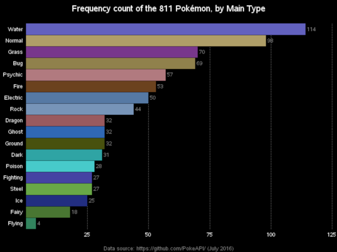

* Discrete, unordered categories (eg. names) <!-- .element: class="fragment" data-fragment-index="1" -->

|||

## Ordinal (ranked)

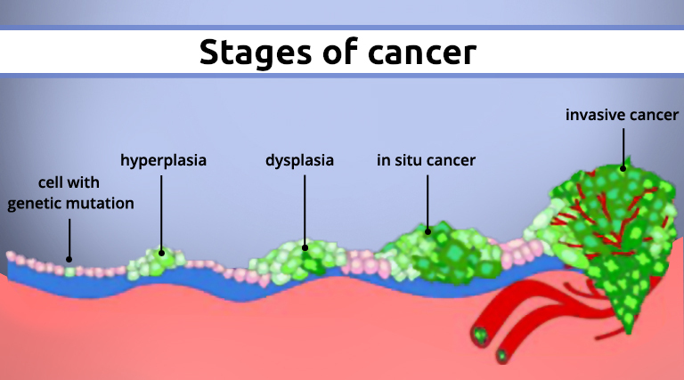

* Discrete, ordered categories, of unknown exact values (eg. cancer stages) <!-- .element: class="fragment" data-fragment-index="1" -->

|||

## Circular

* The lowest and highest value are next to each other (eg. days of the year) <!-- .element: class="fragment" data-fragment-index="1" -->

|||

## Ratios

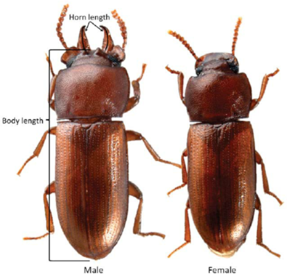

* Ratios of two measurement variables (eg. head size/body size) <!-- .element: class="fragment" data-fragment-index="1" -->

---

## Dependent & independent variables

<ul>
<li class="fragment">Independent variables</li>
<ul>
<li class="fragment">May cause change in dependent variables</li>
</ul>
<li class="fragment">Dependent variables</li>
<ul>
<li class="fragment">Is affected by changes in another variable</li>
</ul>
</ul>

|||

## Which is which?

* Nitrogen content of soil and density of dandelions <!-- .element: class="fragment" data-fragment-index="1" -->
  * Nitrogen content might affect where dandelion plants live <!-- .element: class="fragment" data-fragment-index="2" -->
  * What if dandelions use a lot of nitrogen from the soil? <!-- .element: class="fragment" data-fragment-index="3" -->
* How could we test this? <!-- .element: class="fragment" data-fragment-index="4" -->

---

## [Would you like to know more?](http://www.biostathandbook.com/variabletypes.html)

---

## Accuracy & Precision

1. Random error <!-- .element: class="fragment" data-fragment-index="1" -->
2. Systematic error <!-- .element: class="fragment" data-fragment-index="2" -->
3. Perfect world <!-- .element: class="fragment" data-fragment-index="3" -->

---

## Populations & Samples

---

## Population

 <!-- .element: class="fragment" data-fragment-index="1" -->

* All possible observations <!-- .element: class="fragment" data-fragment-index="2" -->

|||

## Sample 

* Set of observations <!-- .element: class="fragment" data-fragment-index="1" -->

 <!-- .element: class="fragment" data-fragment-index="2" -->

* Sampling method  <!-- .element: class="fragment" data-fragment-index="3" -->
* Sample size "N" <!-- .element: class="fragment" data-fragment-index="4" -->

|||

## Parameters

 <!-- .element: class="fragment" data-fragment-index="1" -->

* Hair colour <!-- .element: class="fragment" data-fragment-index="2" -->

|||

## Parameters

* Missing data

 <!-- .element: class="fragment" data-fragment-index="1" -->

---

## Descriptive statistics

* Central tendency <!-- .element: class="fragment" data-fragment-index="1" -->
* Dispersal <!-- .element: class="fragment" data-fragment-index="2" -->

---

## Central tendency

* Mean - Average of all values <!-- .element: class="fragment" data-fragment-index="1" -->
  * Arithmetic <!-- .element: class="fragment" data-fragment-index="2" -->
  * Geometric <!-- .element: class="fragment" data-fragment-index="2" -->
  * Harmonic <!-- .element: class="fragment" data-fragment-index="2" -->
  * Weighted or unweighted <!-- .element: class="fragment" data-fragment-index="3" -->
* Median - Central occurrence <!-- .element: class="fragment" data-fragment-index="4" -->
* Mode - Most frequent occurrence <!-- .element: class="fragment" data-fragment-index="5" -->

|||

## Central tendency

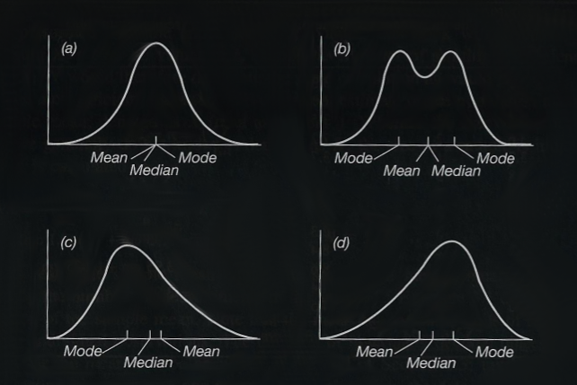

---

## Dispersal

<ul>
<li class="fragment">Range - Diff. between Max. and Min.</li>
<li class="fragment">Variance - [Expectation of the squared deviation of a random variable from its mean](https://www.mathsisfun.com/data/standard-deviation-formulas.html)</li>
<li class="fragment">Standard deviation (σ) - [Square root of variance](https://www.mathsisfun.com/data/standard-deviation-formulas.html)</li>
<li class="fragment">Coefficient of variation - Ratio of Std. Dev. to the mean</li>
<li class="fragment">Standard error - Std. Dev. of the sampling distribution</li>
<li class="fragment">Confidence interval</li>
</ul>

|||

## Dispersal

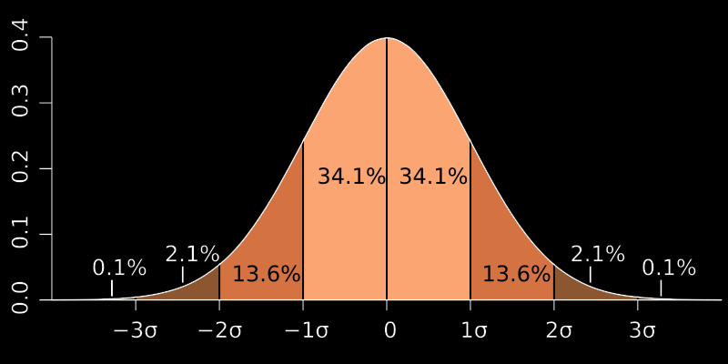

* Avg. = 1 and σ = 0.2 <!-- .element: class="fragment" data-fragment-index="1" -->
* 68% (0.8 - 1.2); 95% (0.6 - 1.4) <!-- .element: class="fragment" data-fragment-index="2" -->

---

## Reporting descriptive statistics

* Use a central tendency measurement coupled with a dispersal measurement <!-- .element: class="fragment" data-fragment-index="1" -->
  * Mean + Std. Dev. <!-- .element: class="fragment" data-fragment-index="2" -->
  * Median + range <!-- .element: class="fragment" data-fragment-index="2" -->
* Always remember: <!-- .element: class="fragment" data-fragment-index="3" -->
  * Which measurements you have used <!-- .element: class="fragment" data-fragment-index="4" -->
  * Present the value of "N" <!-- .element: class="fragment" data-fragment-index="4" -->
  * Indicate the units!!!!111!one! <!-- .element: class="fragment" data-fragment-index="4" -->

---

## Descriptive stats can be deceiving!

[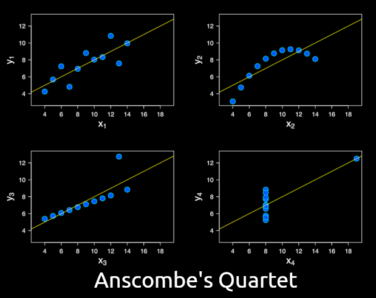](https://en.wikipedia.org/wiki/Anscombe%27s_quartet) <!-- .element: class="fragment" data-fragment-index="1" -->

---

## Other descriptors

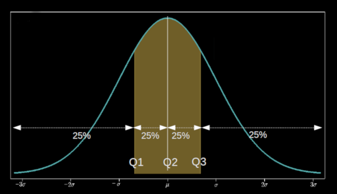

<ul>
<li class="fragment">*q*-Quantiles - Divide the data into *q* subsets of equal size</li>
<ul>
<li class="fragment">Quartiles - Divide the data in 4 equal parts</li>
<li class="fragment">Percentiles - Divide the data into 100 equal parts</li>
</ul>
</ul>

---

## Skewness & Kurtosis

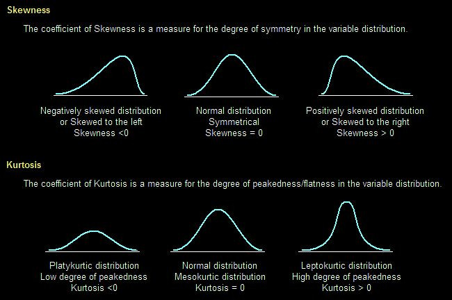 <!-- .element: class="fragment" data-fragment-index="1" -->

---

## Distribution examples

---

## Normal

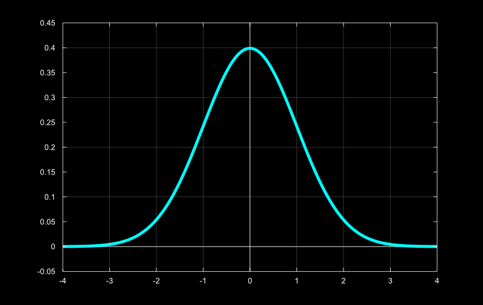

|||

## Exponential

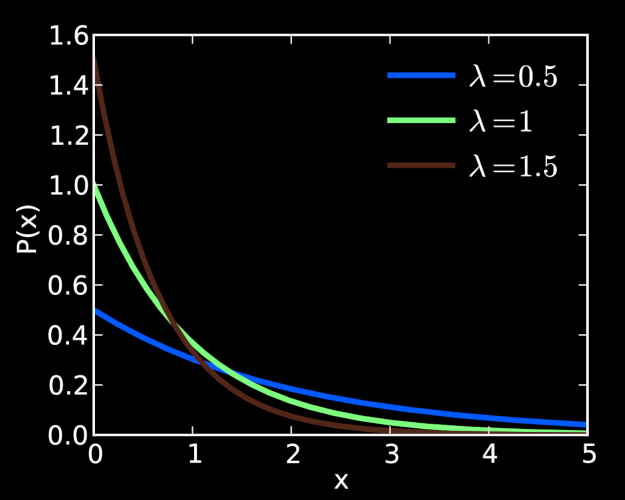

|||

## Poisson

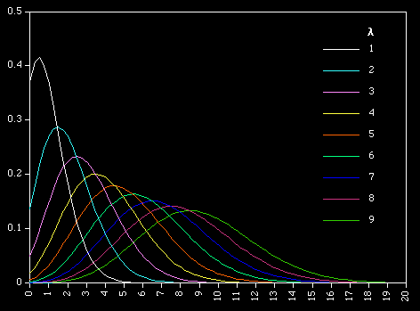

|||

## Lognormal

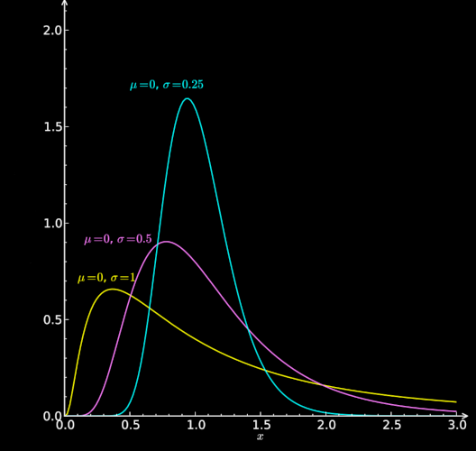

|||

## Beta

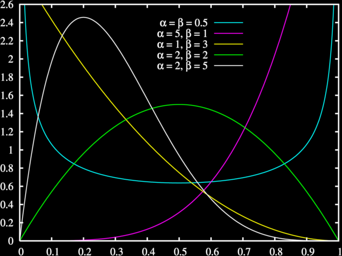

|||

## Gamma

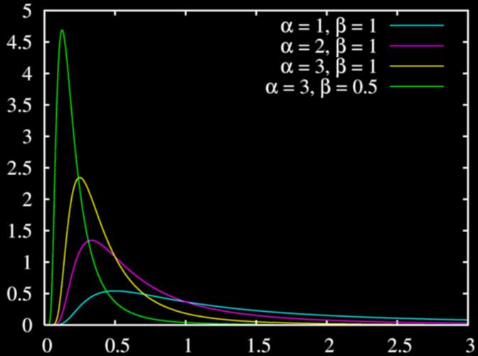

|||

## "Paranormal distribution"

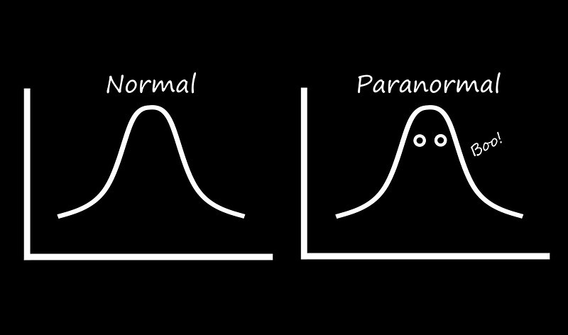

---

## Data transformations

* Logaritmic <!-- .element: class="fragment" data-fragment-index="1" -->
* Square root <!-- .element: class="fragment" data-fragment-index="2" -->
* Exponetial <!-- .element: class="fragment" data-fragment-index="3" -->
* Arcsen <!-- .element: class="fragment" data-fragment-index="4" -->

---

## That's it for today!
