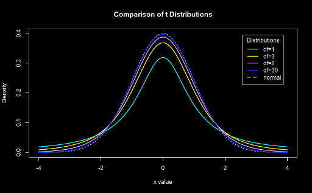
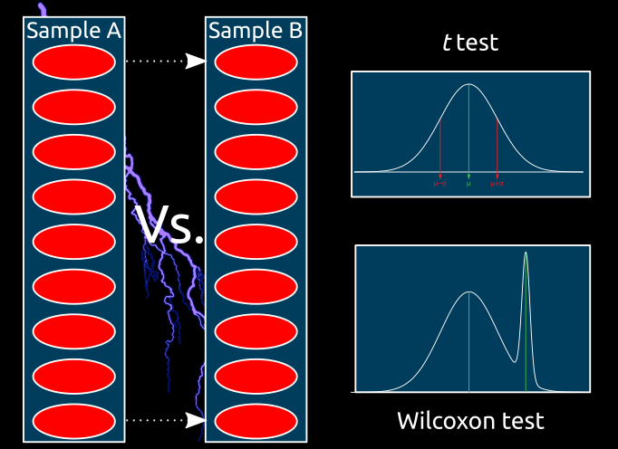

## Hypothesis tests

---

### Main questions

* What are they?
* Why are they necessary? <!-- .element: class="fragment" data-fragment-index="2" -->
* When can they be performed? <!-- .element: class="fragment" data-fragment-index="3" -->

---

### What are hypothesis tests?

* Remember H<sub>0</sub> and H<sub>1</sub>?
* Methods of statistical inference <!-- .element: class="fragment" data-fragment-index="1" -->
* Confirmatory data analysis <!-- .element: class="fragment" data-fragment-index="2" -->
* Used to compare two or more datasets <!-- .element: class="fragment" data-fragment-index="3" -->
	* Sampled <!-- .element: class="fragment" data-fragment-index="4" -->
	* Modeled <!-- .element: class="fragment" data-fragment-index="5" -->

<font color="red">The comparison is considered **significant** if the relationship between the tested datasets is unlikely to be a chance realization of H<sub>0</sub> according to a **pre-determined** threshold.</font> <!-- .element: class="fragment" data-fragment-index="6" -->

---

### Why are they necessary?


When the goal is to make inferences regarding the population
 based on a sample. <!-- .element: class="fragment" data-fragment-index="1" -->

---

### When can they be performed?

* Variable distribution is **known**: <span class="fragment highlight-green">Parametric tests</span>
* Variable distribution is **unknown**: <span class="fragment highlight-red">Non-parametric tests</span>

|||

### Assumptions

* Parametric tests require the data to conform to some parameters
	* These vary from test to test <!-- .element: class="fragment" data-fragment-index="1" -->
* Non-parametric (N-P) tests also have assumptions: <!-- .element: class="fragment" data-fragment-index="2" -->
	* They assume the variables' distributions are similar <!-- .element: class="fragment" data-fragment-index="3" -->

</br>

<font color="red">Parametric tests usually have more statistical power than their N-P counterparts.</font> <!-- .element: class="fragment" data-fragment-index="4" -->

---

## "Simple" tests

---

### Student's *t-test*

The *t-test* can be used to:
* Compare a sample with a value <!-- .element: class="fragment" data-fragment-index="1" -->
* Compare two independent samples <!-- .element: class="fragment" data-fragment-index="2" -->
* Compare two dependent samples <!-- .element: class="fragment" data-fragment-index="3" -->

 <!-- .element: class="fragment" data-fragment-index="4" -->

|||

### Student's *t-test*

```R
x <- seq(-4
 4, length=100)
hx <- dnorm(x)

degf <- c(1
 3, 8, 30)
colors <- c("red"
 "blue", "darkgreen", "gold", "black")
labels <- c("df=1"
 "df=3", "df=8", "df=30", "normal")

plot(x
 hx, type="l", lty=2, xlab="x value",
     ylab="Density"
 main="Comparison of t Distributions")

for (i in 1:4){
    lines(x
 dt(x,degf[i]), lwd=2, col=colors[i])
}

legend("topright"
 inset=.05, title="Distributions",
       labels
 lwd=2, lty=c(1, 1, 1, 1, 2), col=colors)

```

|||

### Student's *t-test*

* A *t-value* is obtained by comparing the two datasets
* This value is compared to the tails of the distribution


---

### Single sample test

* Single sample tests are used to compare a sample against a single value:
	* "Is this sample's value significantly different from a specific value?" <!-- .element: class="fragment" data-fragment-index="1" -->
<center></center> <!-- .element: class="fragment" data-fragment-index="2" -->

---

### Single sample *t-test* example

Is the pH value of water samples significantly different from "neutral" (pH=7)?

What about the "reference value for rivers" (pH=7.7)? <!-- .element: class="fragment" data-fragment-index="1" -->

Let's consider: <!-- .element: class="fragment" data-fragment-index="2" -->
* Data from "Dados_diatoms_heavymetals.csv" <!-- .element: class="fragment" data-fragment-index="3" -->
* Two tailed test <!-- .element: class="fragment" data-fragment-index="4" -->
* Alpha=0.05 <!-- .element: class="fragment" data-fragment-index="5" -->

|||

### Single sample *t-test* example

```R
diatoms = read.csv(url("https://raw.githubusercontent.com/StuntsPT/BP2017/master/classes/C05_assets/Dados_diatoms_heavymetals.csv"))
ph = diatoms$pH

shapiro.test(ph)

t.test(ph
 mu=7, conf.level=0.95)
t.test(ph
 mu=7.7, conf.level=0.95)
```

---

### N-P equivalent - Wilcoxon test

Is the Zinc value of water samples lower than the WHO limit (5000 μg/L)?

Is it above the reference value for rivers (10 μg/L)? <!-- .element: class="fragment" data-fragment-index="1" -->

|||

```R
diatoms = read.csv(url("https://raw.githubusercontent.com/StuntsPT/BP2017/master/classes/C05_assets/Dados_diatoms_heavymetals.csv"))
zn = diatoms$Zn

shapiro.test(zn)

wilcox.test(zn
 mu=5000, alternative="less")
wilcox.test(zn
 mu=10, alternative="greater")
```

---

### 2 samples tests

* 2 samples tests are used to compare the values of two samples.
	* "Are the values of these two samples significantly different from each other?" <!-- .element: class="fragment" data-fragment-index="1" -->

 <!-- .element: class="fragment" data-fragment-index="2" -->

---

### 2 samples *t-test* example

Is the "Dissolved oxygen" different between Northern and Southern rivers?

* Northern rivers: <!-- .element: class="fragment" data-fragment-index="1" -->
	* "Eagle River" <!-- .element: class="fragment" data-fragment-index="1" -->
	* "Blue River" <!-- .element: class="fragment" data-fragment-index="1" -->
	* "Snake River" <!-- .element: class="fragment" data-fragment-index="1" -->
* Southern rivers: <!-- .element: class="fragment" data-fragment-index="2" -->
	* "Arkansas River" <!-- .element: class="fragment" data-fragment-index="2" -->
	* "Chalk Creek" <!-- .element: class="fragment" data-fragment-index="2" -->
	* "South Platte River" <!-- .element: class="fragment" data-fragment-index="2" -->

|||

### 2 samples *t-test* example

```R
diatoms = read.csv(url("https://raw.githubusercontent.com/StuntsPT/BP2017/master/classes/C05_assets/Dados_diatoms_heavymetals.csv"))
north_rivers_doxy = diatoms$Doxy[diatoms$Stream == "ER" | diatoms$Stream == "BR" | diatoms$Stream == "SR"]
south_rivers_doxy = diatoms$Doxy[diatoms$Stream == "AR" | diatoms$Stream == "CC" | diatoms$Stream == "SPR"]

shapiro.test(north_rivers_doxy)
shapiro.test(south_rivers_doxy)

t.test(x=north_rivers_doxy
 y=south_rivers_doxy, conf.level=0.95)
```

---

### N-P equivalent - Mann‐Whitney

Is the "Alkalinity" different between Northern and Southern rivers?

```R
diatoms = read.csv(url("https://raw.githubusercontent.com/StuntsPT/BP2017/master/classes/C05_assets/Dados_diatoms_heavymetals.csv"))
north_rivers_alk = diatoms$Alk[diatoms$Stream == "ER" | diatoms$Stream == "BR" | diatoms$Stream == "SR"]
south_rivers_alk = diatoms$Alk[diatoms$Stream == "AR" | diatoms$Stream == "CC" | diatoms$Stream == "SPR"]

shapiro.test(north_rivers_alk)
shapiro.test(south_rivers_alk)

wilcox.test(x=north_rivers_alk
 y=south_rivers_alk, conf.level=0.95)
```

---

### Dependent samples

If the samples are not independent
 the "normal" tests cannot be used.

* Dependent samples are measurements taken from linked data: <!-- .element: class="fragment" data-fragment-index="1" -->
	* Blood sugar levels in patients
 before and after eating <!-- .element: class="fragment" data-fragment-index="2" -->
	* Size of the left and right pectoral fins of fish <!-- .element: class="fragment" data-fragment-index="3" -->

 <!-- .element: class="fragment" data-fragment-index="4" -->

---

### Dependent samples *t-test* example

Has the rivers' pH changed significantly in the last 25 years?

```R
diatoms = read.csv(url("https://raw.githubusercontent.com/StuntsPT/BP2017/master/classes/C05_assets/Dados_diatoms_heavymetals.csv"))
ph = diatoms$pH

ph2017 = read.csv(url("https://raw.githubusercontent.com/StuntsPT/BP2017/master/classes/C05_assets/diatoms_ph_2017.csv"))$pH

shapiro.test(ph)
shapiro.test(ph2017)

t.test(x=ph, y=ph2017, paired=TRUE, conf.level=0.95)
```

---

### N-P equivalent - Paired Wilcoxon test

```R
diatoms = read.csv(url("https://raw.githubusercontent.com/StuntsPT/BP2017/master/classes/C05_assets/Dados_diatoms_heavymetals.csv"))
ph = diatoms$pH

ph2017 = read.csv(url("https://raw.githubusercontent.com/StuntsPT/BP2017/master/classes/C05_assets/diatoms_ph_2017.csv"))$pH

shapiro.test(ph)
shapiro.test(ph2017)

wilcox.test(x=ph, y=ph2017, paired=TRUE, conf.level=0.95)

```

---

## Sum up

---

### Single sample


---

### Two independent samples


---

### Two dependent samples



---

## Error handling

---

### Type I and Type II errors

|                               |H<sub>0</sub> True                     |H<sub>0</sub> False                   |
|-------------------------------|---------------------------------------|--------------------------------------|
|**Do not Reject H<sub>0</sub>**|<font color="green">Correct</font>     |<font color="red">Type II Error</font>|
|**Reject H<sub>0</sub>**       |<font color="red">Type I Error</font>  |<font color="green">Correct</font>    |

|||

### Type II Error


---

## Multiple tests

[Mandatory XKCD](https://xkcd.com/882/) <!-- .element: class="fragment" data-fragment-index="1" -->

---

### The problem of multiple testing

* The more inferences are made, the more likely errors are to occur
* Therefore, significance levels need to be adjusted <!-- .element: class="fragment" data-fragment-index="2" -->
* These should scale with the number of tests <!-- .element: class="fragment" data-fragment-index="3" -->

---

### Correcting for multiple tests

* Bonferroni correction <!-- .element: class="fragment" data-fragment-index="1" -->
	* As simple as α/number of tests <!-- .element: class="fragment" data-fragment-index="1" -->
	* Deemed too conservative <!-- .element: class="fragment" data-fragment-index="1" -->
* FDR test <!-- .element: class="fragment" data-fragment-index="2" -->
	* Adjusts the p-value into a q-value <!-- .element: class="fragment" data-fragment-index="2" -->
	* Has more power at the cost of more false positives <!-- .element: class="fragment" data-fragment-index="2" -->

|||

### Performing corrections

```R
p_vals = c(0.05, 0.01, 0.001, 0.08, 0.04, 0.03)
p.adjust(p_vals, method="fdr")
p.adjust(p_vals, method="bonferroni")
```

---

### A good reference

[Handbook of Biological Statistics](http://www.biostathandbook.com)
