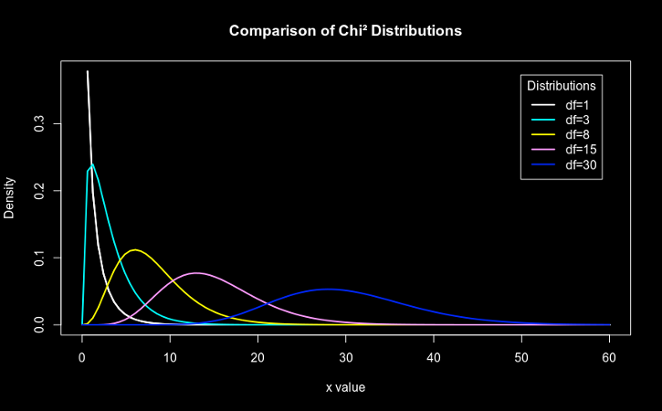

### Class #6

#### Bioinformática Prática 2019


<center>Francisco Pina Martins</center>

<center>[@FPinaMartins](https://twitter.com/FPinaMartins)</center>

---

## Hypotheses tests II

---

### Goodness of fit tests

* When can they be performed?
* Why are they necessary?
* Which tests are these?

---

### When can they be performed?

<ul>
<li class="fragment" data-fragment-index="1">When the data consists of:</li>
  <ul>
  <li class="fragment" data-fragment-index="2">Categorical variables</li>
  <li class="fragment" data-fragment-index="2">Counts data</li>
  </ul>
</ul>

---

### Why are they necessary?

* When comparing observation counts to an expectation
* Examples: <!-- .element: class="fragment" data-fragment-index="1" -->
	* Is our sample of male and female individuals representative of the population's sex ratio? <!-- .element: class="fragment" data-fragment-index="1" -->
	* Are our counts of crossed flower colours matched to the expected Mendelian inheritance? <!-- .element: class="fragment" data-fragment-index="2" -->


---

### What are they?

<ul>
<li class="fragment" data-fragment-index="1">There are several ways to test the [conformance to expectations](https://www.youtube.com/watch?v=7jMlFXouPk8) (goodness of fit)</li>
  <ul>
  <li class="fragment" data-fragment-index="2"><span class="fragment highlight-green" data-fragment-index="3">(Pearson's) Chi² test</span></li>
  <li class="fragment" data-fragment-index="2"><span class="fragment fade-out" data-fragment-index="3">G-test</span></li>
  <li class="fragment" data-fragment-index="2"><span class="fragment highlight-green" data-fragment-index="3">Binomial/multinomial test</span></li>
  </ul>
</ul>

---

### Chi² test

* Requires a "large" sample size
* Is computationally simple <!-- .element: class="fragment" data-fragment-index="1" -->
* Uses the "chi-square" distribution <!-- .element: class="fragment" data-fragment-index="2" -->

 <!-- .element: class="fragment" data-fragment-index="3" -->

|||

### Chi² distribution plots

```R
x <- seq(0, 60, length=100)
hx <- dchisq(x, df=1)

degf <- c(1, 3, 8, 15, 30)
colors <- c("black", "red", "blue", "darkgreen", "gold")
labels <- c("df=1", "df=3", "df=8", "df=15", "df=30")

plot(x, hx, type="l", lwd=2, xlab="x value",
     ylab="Density", main="Comparison of Chi² Distributions")

     for (i in 1:5){
         lines(x, dchisq(x,degf[i]), lwd=2, col=colors[i])
	 }

legend("topright", inset=.05, title="Distributions",
       labels, lwd=2, col=colors)
```

|||

### The Null hypothesis

"The number of observatons in each category is not different from the expectation" <!-- .element: class="fragment" data-fragment-index="1" -->

---

### Example

* Consider the sex ratio of grasshoppers *Dichroplus maculipennis* (Blanchard)
	* 6038 individuals were collected and sexed <!-- .element: class="fragment" data-fragment-index="1" -->
	* 2235 females and 2301 males <!-- .element: class="fragment" data-fragment-index="2" -->
	* The expected proportion of female:male ratio is 1:1 <!-- .element: class="fragment" data-fragment-index="3" -->

[Reference](http://www.sciencedirect.com/science/article/pii/S0085562615000321) <!-- .element: class="fragment" data-fragment-index="4" -->

|||

### Example

```R
obs = c(2235, 2301)
exp = c(0.5, 0.5)

chisq.test(x=obs, p=exp)
```

---

### Multiple testing

* When there are more than 2 categories
	* Each category can be tested against the sum of all other categories <!-- .element: class="fragment" data-fragment-index="1" -->
	* FDR or Bonferroni corrections must be applied <!-- .element: class="fragment" data-fragment-index="2" -->

|||

### Multiple testing example

<ul>
<li class="fragment">Suppose we have flowers where alleles determine colour <font color="red">AA</font>, <font color="pink">Aa</font>, <font color="white">aa</font>.</li>
  <ul>
  <li class="fragment">This trait has Mendelian inheritance</li>
  <li class="fragment">All F0 males are white</li>
  <li class="fragment">All F0 females are red</li>
  <li class="fragment">F1 contains <font color="red">1300</font>, <font color="pink">3000</font>, <font color="white">1500</font></li>
  </ul>
</ul>

Are these proportions according to the expectation of 1:2:1 ? <!-- .element: class="fragment" -->

|||

## Multiple testing example

```R
obs = c(1300, 3000, 1500)
exp = c(0.25, 0.5, 0.25)

chisq.test(x=obs, p=exp)

p_vals = c()

partial_obs = c(obs[1], sum(obs[-1]))
partial_exp = c(exp[1], sum(exp[-1]))
part_chisq = chisq.test(x=partial_obs, p=partial_exp)

pvalue = part_chisq$p.value

p_vals = c(p_vals, pvalue)

partial_obs = c(obs[2], sum(obs[-2]))
partial_exp = c(exp[2], sum(exp[-2]))
part_chisq = chisq.test(x=partial_obs, p=partial_exp)

pvalue = part_chisq$p.value

p_vals = c(p_vals, pvalue)

partial_obs = c(obs[3], sum(obs[-3]))
partial_exp = c(exp[3], sum(exp[-3]))
part_chisq = chisq.test(x=partial_obs, p=partial_exp)

pvalue = part_chisq$p.value

p_vals = c(p_vals, pvalue)

print(p_vals)
p.adjust(p_vals, method="fdr")
```

|||

## Multiple testing example

```R
obs = c(1300, 3000, 1500)
exp = c(0.25, 0.5, 0.25)

chisq.test(x=obs, p=exp)

p_vals = c()

for (i in 1:length(obs)) {
    partial_obs = c(obs[i], sum(obs[-i]))
    partial_exp = c(exp[i], sum(exp[-i]))
    part_chisq = chisq.test(x=partial_obs, p=partial_exp)
    
    p_vals[i] = part_chisq$p.value
}

print(p_vals)
p.adjust(p_vals, method="fdr")
```

---

### What about 'small' samples?

* When the sample size is small, the Chi² test can be inaccurate
* In these cases an exact test should be employed <!-- .element: class="fragment" data-fragment-index="1" -->
	* Can be used with small samples <!-- .element: class="fragment" data-fragment-index="2" -->
	* Is computationally intensive <!-- .element: class="fragment" data-fragment-index="3" -->
	* Also called a "binomial" or "multinomial" test <!-- .element: class="fragment" data-fragment-index="4" -->

 <!-- .element: class="fragment" data-fragment-index="5" -->

|||

### Let's try another example

```R
obs = c(3, 11)
exp = c(0.5, 0.5)

chisq.test(x=obs, p=exp)

binom.test(x=obs[1], n=sum(obs), p=exp[1], conf.level=0.95)
```

|||

### Multinomial example

```R
if(!require("XNomial")){
    install.packages("XNomial")
        library("XNomial")
	}

	obs = c(4, 27, 12)
	exp = c(0.25, 0.5, 0.25)

	chisq.test(x=obs, p=exp)

	xmulti(obs=obs, expr=exp)

```

---

### Independence tests

* When can they be performed?
* Why are they necessary?
* Which tests are these?

---

### When can they be performed?

<ul>
<li class="fragment" data-fragment-index="1">When the data consists of:</li>
  <ul>
  <li class="fragment" data-fragment-index="2">Categorical variables</li>
  <li class="fragment" data-fragment-index="2">Counts data</li>
  <li class="fragment" data-fragment-index="2">Contingency tables</li>
  </ul>
</ul>

---

### Why are they necessary?

* Each entry represents a variable frequency distribution <!-- .element: class="fragment" data-fragment-index="1" -->
* Used to test whether the proportions of one variable are different for different values of the other variable <!-- .element: class="fragment" data-fragment-index="3" -->
* Examples: <!-- .element: class="fragment" data-fragment-index="4" -->
	* Are a class' grades gender independent? <!-- .element: class="fragment" data-fragment-index="4" -->
	* Are the side effects of a new drug more prone to occur if it is taken at night or in the morning? <!-- .element: class="fragment" data-fragment-index="5" -->

---

### What are they?

<ul>
<li class="fragment" data-fragment-index="1">There are several ways to perform independence tests:</li>
  <ul>
  <li class="fragment" data-fragment-index="2"><span class="fragment highlight-green" data-fragment-index="3">Chi² test of independence</span></li>
  <li class="fragment" data-fragment-index="2"><span class="fragment fade-out" data-fragment-index="3">G-test of independence</span></li>
  <li class="fragment" data-fragment-index="2"><span class="fragment highlight-green" data-fragment-index="3">Fisher's exact test</span></li>
  </ul>
</ul>

---


### Chi² test of independence

* Requires a "large" sample size
* Is computationally simple <!-- .element: class="fragment" data-fragment-index="1" -->
* Uses the "chi-square" distribution <!-- .element: class="fragment" data-fragment-index="2" -->

 <!-- .element: class="fragment" data-fragment-index="3" -->

|||

### Chi² test of independence example

* Suppose the following situation:
	* A new drug for migraines is being tested
	* It has some (uncommon) side effects <!-- .element: class="fragment" data-fragment-index="1" -->
	* We want to know if the side effects occur more often when the drug is taken at night or in the morning <!-- .element: class="fragment" data-fragment-index="2" -->
	* Of the 4682 cases where the drug was taken at night, 30 reported side effects <!-- .element: class="fragment" data-fragment-index="3" -->
	* Of the 8813 cases where it was taken in the morning, 76 reported side effects <!-- .element: class="fragment" data-fragment-index="4" -->

|||

### Chi² test of independence example

```R
total_night = 4682
se_night = 30
total_morning = 8813
se_morning = 76
R1 = c((total_night - se_night), se_night)
R2 = c((total_morning - se_morning), se_morning)

side_effects_matrix = matrix(c(R1, R2),
                             nrow=2,
                             byrow=TRUE)

# Naming is not mandatory:
rownames(side_effects_matrix) = c("Night", "Morning")
colnames(side_effects_matrix) = c("No.side.effects",
                                  "Side.effects")


chisq.test(side_effects_matrix,
           correct=TRUE)
```

|||

### The Null hypothesis

"The relative porportions of the variables are independent from each other" <!-- .element: class="fragment" data-fragment-index="1" -->

---

### What about 'small' samples?

* When the sample size is small, the Chi² test can be inaccurate
* In these cases an exact test should be employed <!-- .element: class="fragment" data-fragment-index="1" -->
	* Can be used with small samples <!-- .element: class="fragment" data-fragment-index="2" -->
	* Is computationally intensive <!-- .element: class="fragment" data-fragment-index="3" -->
	* Fischer's exact test of independence <!-- .element: class="fragment" data-fragment-index="4" -->

---

### Fisher's exact test

* Consider the following situation:
	* Plants in a garden are watered in different intervals
	* Daily, Weekly, Monthly and Quarterly <!-- .element: class="fragment" data-fragment-index="1" -->
	* After a year, the plants' survival rate is measured <!-- .element: class="fragment" data-fragment-index="2" -->
	* Does the watering frequency make a difference for these plants?  <!-- .element: class="fragment" data-fragment-index="3" -->

<table>
<tr><td>Frequency</td><td>Dead</td><td>Alive</td></tr>
<tr><td>Daily</td><td>1</td><td>24</td></tr>
<tr><td>Weekly</td><td>5</td><td>20</td></tr>
<tr><td>Monthly</td><td>14</td><td>11</td></tr>
<tr><td>Quarterly</td><td>11</td><td>14</td></tr>
<tr><td></td></tr>
</table> <!-- .element: class="fragment" data-fragment-index="4" -->

|||


### Fisher's exact test

```R
text_input =("
Frequency  Dead  Alive
Daily       1        24
Weekly      5        20
Monthly    14        11
Quarterly  11        14
")

small_samples_matrix = as.matrix(read.table(textConnection(text_input),
                                 header=TRUE,
                                 row.names=1))

fisher.test(small_samples_matrix)
```

---

### Regression Analysis

* What is it?
* Why is it necessary? <!-- .element: class="fragment" data-fragment-index="1" -->
* When can it be performed? <!-- .element: class="fragment" data-fragment-index="2" -->

---

### What is a regression analysis?

* Subset of ["Statistical Modeling"](https://en.wikipedia.org/wiki/Statistical_model)
* Analyse the relationship between a dependent variable and an independent variable <!-- .element: class="fragment" data-fragment-index="1" -->
* Used to estimate a regression function <!-- .element: class="fragment" data-fragment-index="2" -->

---

### Why use regression analysis?

* To test if two variables are associated with each other (*p*-value)
* To measure the strength of the association between variables (r²) <!-- .element: class="fragment" data-fragment-index="1" -->
* To obtain an equation suitable to make predictions <!-- .element: class="fragment" data-fragment-index="2" -->

 <!-- .element: class="fragment" data-fragment-index="3" -->

|||

### Plot code

```R
height <- c(176, 154, 138, 196, 132, 176, 181, 169, 150, 175)
bodymass <- c(82, 49, 53, 112, 47, 69, 77, 71, 62, 78)

plot(bodymass, height)

plot(bodymass, height, pch = 16, cex = 1.3, col = "blue",
     main = "HEIGHT PLOTTED AGAINST BODY MASS",
     xlab = "BODY MASS (kg)",
     ylab = "HEIGHT (cm)")

abline(lm(height ~ bodymass))

```

[Source](http://www.theanalysisfactor.com/linear-models-r-plotting-regression-lines/)

---

### Regression vs correlation

* In correlation, both samples are random
* In regression, one sample is controlled <!-- .element: class="fragment" data-fragment-index="1" -->
* Can be hard to categorize <!-- .element: class="fragment" data-fragment-index="2" -->
* The r² value is not as meaningful in regression as it is on correlation <!-- .element: class="fragment" data-fragment-index="3" -->

---

### Assumptions

* Normality
* Homecedasticity <!-- .element: class="fragment" data-fragment-index="1" -->
* Linearity <!-- .element: class="fragment" data-fragment-index="2" -->
* Independence <!-- .element: class="fragment" data-fragment-index="3" -->

|||

### Non-parametric alternative

* Spearman's rank correlation (non-normal or non-homocedastic data)
* Kendall correlation (non-linearity)

---

### The Null hypothesis

The slope of the best-fit line is == 0. <!-- .element: class="fragment" data-fragment-index="1" -->
As the variable in the "X" axis increases, the variable in the "Y" axis neither increases nor decreases. <!-- .element: class="fragment" data-fragment-index="2" -->

---

### A word of caution

## <font color="red">Correlation does not imply causation</font> <!-- .element: class="fragment" data-fragment-index="1" -->

---

### Worked example - species diversity

[Source](http://rcompanion.org/rcompanion/e_01.html)

```R
Input = ("
Town                  State  Latitude  Species
'Bombay Hook'          DE     39.217    128
'Cape Henlopen'        DE     38.800    137
'Middletown'           DE     39.467    108
'Milford'              DE     38.958    118
'Rehoboth'             DE     38.600    135
'Seaford-Nanticoke'    DE     38.583     94
'Wilmington'           DE     39.733    113
'Crisfield'            MD     38.033    118
'Denton'               MD     38.900     96
'Elkton'               MD     39.533     98
'Lower Kent County'    MD     39.133    121
'Ocean City'           MD     38.317    152
'Salisbury'            MD     38.333    108
'S Dorchester County'  MD     38.367    118
'Cape Charles'         VA     37.200    157
'Chincoteague'         VA     37.967    125
'Wachapreague'         VA     37.667    114
")

Data = read.table(textConnection(Input),header=TRUE)
```

[Alternative](https://gitlab.com/StuntsPT/bp2019/raw/master/docs/classes/C06_assets/species_diversity.tsv)

|||

### Worked example - species diversity

Data plot

```R
plot(Species ~ Latitude,
     data=Data,
     pch=16,
     xlab = "Latitude",
     ylab = "Species")
```

|||

### Worked example - species diversity

Correlation & regression analyses

```R
# Correlation
cor.test(x=Data$Latitude,
         y=Data$Species,
         method = "pearson",
         conf.level = 0.95)

# Regression
model = lm(Species ~ Latitude,
           data = Data)
summary(model)
```

|||

### Worked example - species diversity

Plot the regression line

```R
intercept = model$coefficient["(Intercept)"]
slope = model$coefficient["Latitude"]

plot(Species ~ Latitude,
     data = Data,
     pch=16,
     xlab = "Latitude",
     ylab = "Species")

abline(intercept, slope,
       lty=1, lwd=2, col="blue")
```

---

### Reference

[Handbook of Biological Statistics](http://www.biostathandbook.com)

